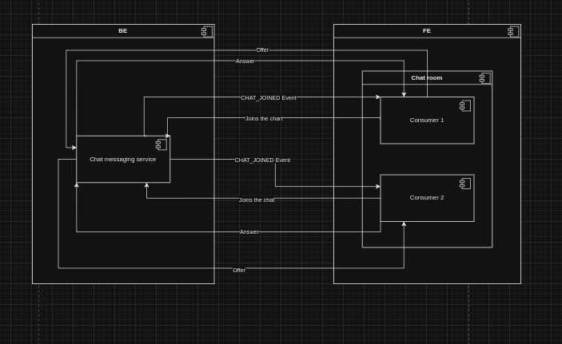
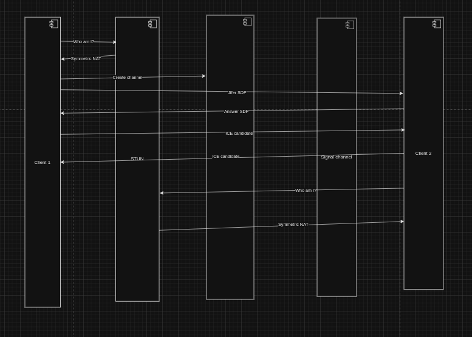

# Відеоконференції

## Створення
- Простий та зручний застосунок для відеоконференцій, який повторює основний функціонал Google Meet.
- Миттєві відеозустрічі.
- Планування зустрічей на майбутнє.
- Підтримка до 100 учасників у безкоштовній версії.
- Тривалість зустрічей до 60 хвилин для групових дзвінків (безкоштовна версія).

## Інтерфейс користувача
- Простий та інтуїтивно зрозумілий дизайн.
- Адаптивний інтерфейс для різних пристроїв (ПК, планшети, смартфони).
- Режим "мозаїка" для відображення кількох учасників одночасно.

## Функції під час зустрічі
- Вмикання/вимикання камери та мікрофону.
- Демонстрація екрану.
- Текстовий чат для обміну повідомленнями.
- Функція "підняти руку" для привернення уваги.

## Технічні аспекти
- Веб-версія, що працює в більшості сучасних браузерів.
- Використання WebRTC для забезпечення якісного відео- та аудіозв'язку.

## Перспективи розвитку
- Google Calendar, Slack integrations (mb later)
- Remote desktop control
- Можливість змінювати фон (розмиття або віртуальний фон)
- Додавання функції віртуальної дошки для спільної роботи.
- Автоматичні субтитри, шумопоглинання, аналізатор зустрічей (типу як в loom).

# Завдання 2
## Комміти що виконують це завдання:
- https://github.com/rooms-soft/app-fe/commit/12e3620eff47666e2b1ee2c64f8cdb72b23d46e8, 
https://github.com/rooms-soft/app-fe/commit/468f3a076dfbd4d3eec089f90f8d06bb25e41f60
- https://github.com/rooms-soft/app-be/commit/d670f141aa674979e84a3b4708e298e60b3d37da,
https://github.com/rooms-soft/app-be/commit/c43fcf68eb50d327212e0ccf7456b957a5f68cb8

# Завдання 3
При підключенні до чату, користувач надсилає івент у Message Service. 
Після цього кожен наявний користувач у чаті отримує повідомлення про нового користувача.
Потім кожен користувач встановлює підключення до нового користувача через WebRTC.

Встановлення Peer коннекшену між двома користувачами відбувається наступним чином:
- Цей обмін здійснюється за допомогою протоколу опису сесій (SDP). 
Кожен SDP міститиме інформацію про відправника.
- Користувач обмінюється пропозицією, щоб отримати відповідь.
- Після завершення пари обмінів відправник надає одержувачу інформацію про свою мережу 
та інструкції щодо того, як спілкуватися з ним за допомогою WebRTC. 
Цей обмін мережевою інформацією здійснюється за допомогою протоколу ICE.

